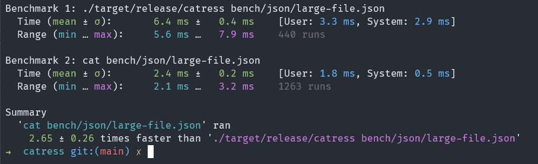

# catress

A simple command line tool to read files.

## Usage

To read a file simply run:

```sh
catress file.txt
```

And, to read multiple files simply run:

```sh
catress file1.txt file2.txt
```

## Benchmark



It's slower than the good old 'cat', tested on a json file with 15k lines.
